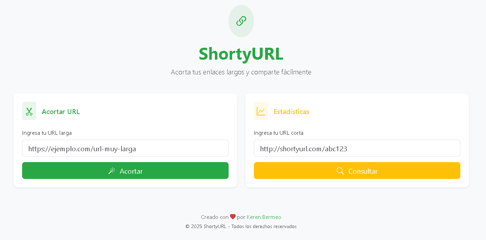

# 🔗 ShortyURL - API de Acortamiento de URLs

ShortyURL es una API simple y funcional que permite acortar URLs largas en enlaces cortos y fáciles de manejar. Está desarrollada con **Python**, **Flask** y usa **MongoDB** como base de datos. Es ideal para desarrolladores que desean integrar el acortamiento de URLs en sus propias aplicaciones.

---

## 🚀 Funcionalidades

- 📥 Acorta URLs largas en segundos.
- 🔁 Redirección automática al acceder al enlace corto.
- 📂 Almacenamiento de URLs usando MongoDB.
- ✅ Verificación de URLs duplicadas.
- 🧠 Generación automática de ID únicos.
- 🔒 Variables de entorno para configuración segura.

---

## 🛠️ Tecnologías utilizadas

- Python 3
- Flask
- MongoDB
- PyMongo
- Dotenv
- HTML/CSS básico para la interfaz
- JavaScript (mínimo para formulario)

---

## 📸 Vista previa



---

## 🧪 Cómo usarlo

### 1. Clonar el repositorio

```bash
git clone https://github.com/KerenBermeo/ShortyURL.git
cd shortyurl
```

### 2. Instalar dependencias

Asegúrate de tener `pip` instalado:

```bash
pip install -r requirements.txt
```

### 3. Configurar las variables de entorno

Crea un archivo `.env` en la raíz con el siguiente contenido:

```
SECRET_KEY=tu_clave_secreta
BASE_URL=http://localhost:5000
FLASK_ENV=development
FLASK_HOST=0.0.0.0
FLASK_PORT=5000
MONGO_URI=tu_uri_de_conexion
```

### 4. Ejecutar la aplicación

```bash
python main.py
```

---

## 📬 Uso de la API

### `POST /shorten`

Acorta una URL.

**Body JSON:**

```json
{
  "url": "https://ejemplo.com/url-muy-larga"
}
```

**Respuesta:**

```json
{
  "original_url": "https://ejemplo.com/url-muy-larga",
  "short_url": "http://localhost:5000/Xyz12"
}
```

### `GET /<short_id>`

Redirige a la URL original.

---

## 🧠 Aprendizajes

- Primer acercamiento práctico a **Flask** y arquitectura REST.
- Conexión y uso de base de datos **NoSQL con MongoDB**.
- Buenas prácticas con variables de entorno y organización básica de código.

---

## ✍️ Autora

**Keren Bermeo**  
[LinkedIn](https://www.linkedin.com/in/keren-bermeo-162655185/)  
💻 Aprendiz de desarrollo backend.

---

## 📌 Notas

Este proyecto fue creado con fines educativos y como parte de mi portafolio. Siéntete libre de dejar feedback o abrir issues. 😊
